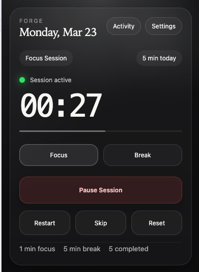

# Forge — Chrome Extension

A focused Pomodoro timer for Google Chrome. Tracks your sessions, reminds you to break, and syncs across Chrome profiles via Supabase.

Originally built with Codex (GPT-5.4). Continued and improved with Claude Sonnet 4.6.

---



---

## What it does

- Focus and break timer with configurable durations
- Session history and weekly activity chart with Y-axis labels
- Streak tracking — consecutive days with focus sessions
- Daily breakdown of the last 7 days (in both popup and standalone activity page)
- Contextual completion messages based on streak and milestone progress
- Sound notifications (distinct chimes for focus done, break done, and every 4th session milestone)
- Chrome system notifications when a session ends
- In-popup completion modal with streak badge
- Account sync across Chrome profiles (Supabase auth)

## Changelog

### 2026-04-07

**Activity & UX improvements:**
- Added streak counter — tracks consecutive days with focus sessions, shown in activity stat cards and completion modal
- Ported daily breakdown list from standalone activity page into the popup activity view (compact, scrollable)
- Added Y-axis labels to all bar charts for readability
- Contextual completion messages — modal text varies based on streak length and milestone status
- Streak badge (amber pill) appears in completion modal when streak >= 2 days
- Fixed stat card text overflow — reduced label letter-spacing, added overflow protection
- Fixed large vertical gap in popup activity/settings views (align-content: start)
- Bar chart now always renders (even with 0 data) instead of being hidden

## Install in Chrome

1. Clone the repo and run `npm install && npm run build`
2. Open `chrome://extensions` in Chrome
3. Turn on **Developer mode** (top right)
4. Click **Load unpacked** → select the `dist/` folder
5. Forge appears in your Chrome toolbar

After any code change: `npm run build` → hit **Reload** on the extension card in `chrome://extensions`.

## Development

```bash
npm install      # install dependencies
npm run build    # build to dist/
```

Requires a `.env.local` with:

```
VITE_SUPABASE_URL=...
VITE_SUPABASE_PUBLISHABLE_KEY=...
```

## Structure

```
src/
  background/   timer logic, alarms, notifications, sound trigger
  offscreen/    Web Audio chime player (offscreen document for MV3)
  popup/        main UI — timer, activity, settings views
  shared/       types, storage, Supabase client, analytics, account sync
public/
  manifest.json Chrome extension manifest (MV3)
```
